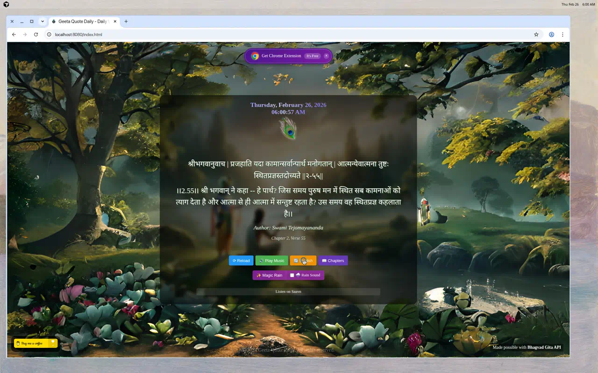
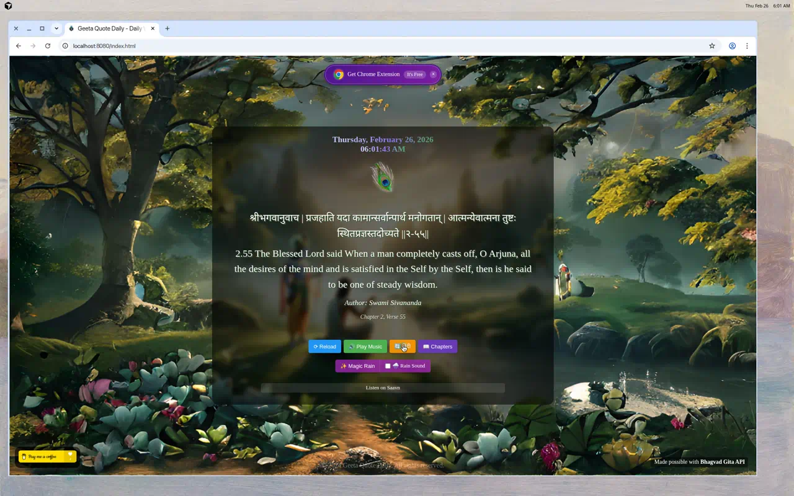
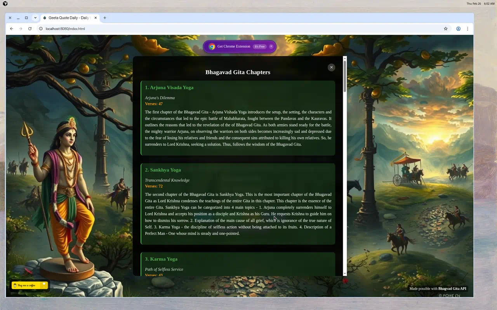
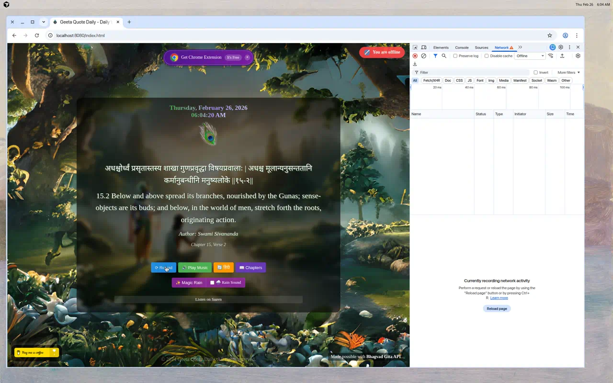
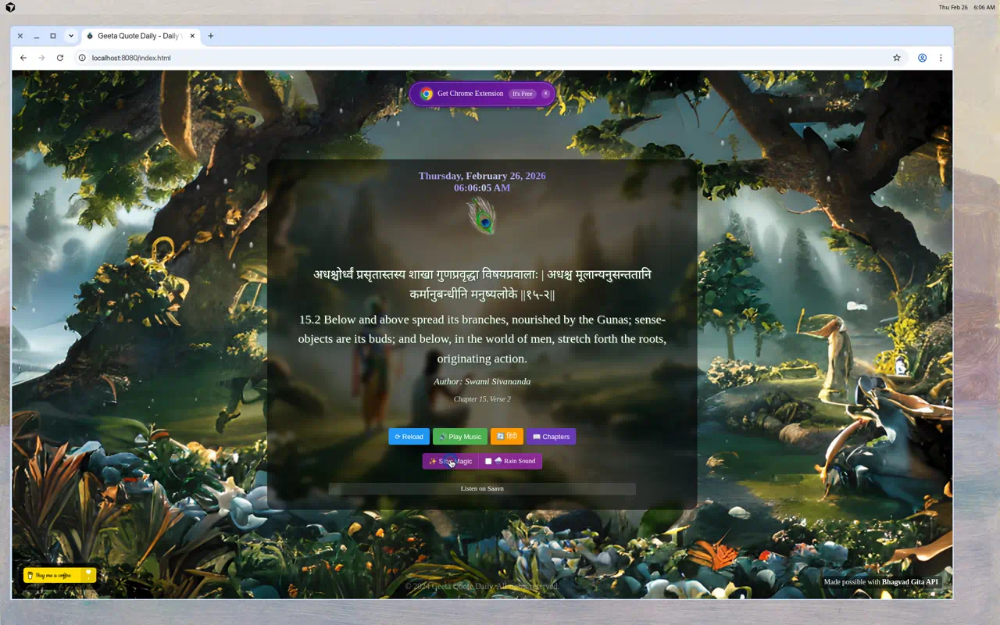
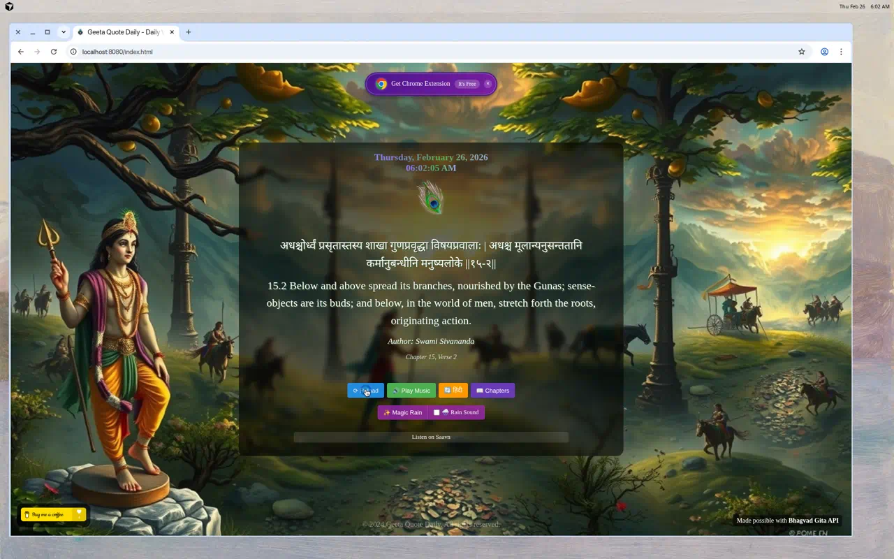

# Geeta Quote Daily

Geeta Quote Daily is a Chrome extension that offers daily inspirational quotes from the Bhagavad Gita. It's designed to provide users with spiritual enrichment and thoughtful insights every time they open a new tab, featuring serene and beautiful artwork inspired by ancient Indian scripture and culture.

## Features

- **Daily Inspiration**: Enjoy a new, thought-provoking quote from the Bhagavad Gita each day.
- **Beautiful Imagery**: Each quote is accompanied by serene visuals, including peacock feathers and other symbolic references, to enhance the reading experience.
- **Background Music**: Users can listen to soothing Krishna flute music while reading the quote, adding to the ambiance.
- **Bilingual Support**: Toggle between Hindi and English translations with a single click.
- **Chapter Browser**: Explore all 18 chapters of the Bhagavad Gita with detailed descriptions and verse counts.
- **Magic Rain Effect**: Activate a beautiful sparkle rain animation overlay for a meditative atmosphere.
- **Online/Offline Status**: Automatically detects network status and shows cached quotes when offline with a visual indicator.
- **Rain Sound**: Enable ambient rain sound with adjustable volume for a relaxing experience.

## Demo

Click on the image below to watch the demo of Geeta Quote Daily:

Experience Geeta Quote Daily live: [https://geeta-quote-daily.vercel.app/](https://geeta-quote-daily.vercel.app/)

### Feature Screenshots

**Main View — Daily Quote in Hindi**

**English Translation Toggle**

**Chapter Browser — Explore All 18 Chapters**

**Offline Status Indicator**

**Magic Rain Effect**

**New Quote on Reload**

## Installation

Chrome Web Store installation link: https://chromewebstore.google.com/detail/geeta-quote-daily/mchnncpedilhkilmpcmoaokgmlglkfab

### Install it from source

To install TripleKey Tabs Navigator from source:

1. Download the zip file from [GitHub](https://github.com/rohit-wadhwa/geeta-quote-daily/archive/master.zip) or from the [release page](https://github.com/rohit-wadhwa/geeta-quote-daily/releases).
2. Extract the ZIP file to a folder on your computer.
3. Open Chrome and navigate to `chrome://extensions`.
4. Enable "Developer mode" by toggling the switch in the top-right corner.
5. Click on "Load Unpacked" and select the extracted folder.
6. The extension should now be installed locally and ready to inspire.

## User Use Case

This extension is perfect for individuals looking to incorporate a moment of reflection and inspiration into their daily routine. Whether starting the day with a positive thought or taking a midday break to refocus and recharge, Geeta Quote Daily provides valuable insights and a peaceful break from the hustle and bustle.

## Support

Found Geeta Quote Daily inspiring or useful? Consider [supporting further development](https://www.buymeacoffee.com/rohit.wadhwa).

## Contributing

Contributions are what make the open-source community such an amazing place to learn, inspire, and create. Any contributions you make are **greatly appreciated**.

- Fork the project.
- Create your feature branch (`git checkout -b feature/AmazingFeature`).
- Commit your changes (`git commit -m 'Add some AmazingFeature'`).
- Push to the branch (`git push origin feature/AmazingFeature`).
- Open a Pull Request.

## License

Distributed under the MIT License. See `LICENSE` for more information.

## 📢 Support or Contact

Having trouble with Geeta Quote Daily? Check out our GitHub repository for documentation and support or contact us directly for help.

####

## Special Thanks

Special thanks to the [Bhagavad Gita API](https://bhagavadgitaapi.in/) for providing the essential data that powers the Geeta Quote Daily extension. This wonderful API has made it possible to share inspirational quotes from the Bhagavad Gita with users around the world.

We are also grateful to [Pt. Prashant Tripathi](https://github.com/ptprashanttripathi), the creator of the Bhagavad Gita API, for his invaluable contribution to making ancient wisdom accessible in the digital age. His work has significantly enriched this extension and the experience it offers to its users.

## Acknowledgements

- [Bhagavad Gita API](https://bhagavadgitaapi.in/) for the API that serves the core functionality of delivering daily quotes.
- Icons and images created and used under license.
- Background music sourced from Saavn, with a direct link for user convenience.

Project Link: [https://github.com/rohit-wadhwa/geeta-quote-daily](https://github.com/rohit-wadhwa/geeta-quote-daily)

